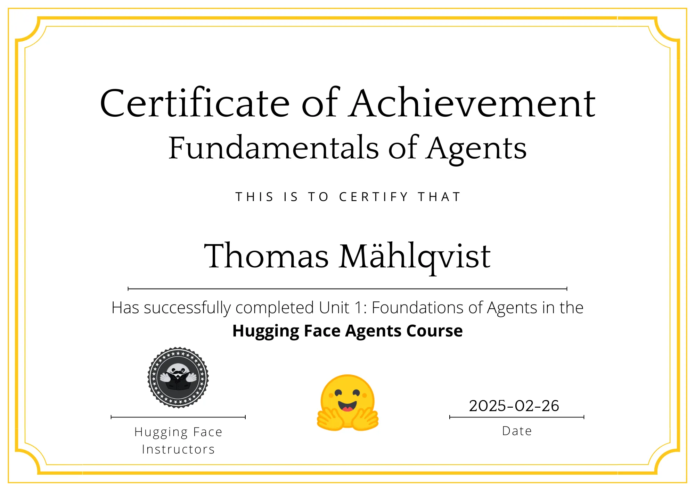

# Dummy Agent

This course will use a dummy agent library and a simple serverless API to access the LLM engine.

First we have to install the libraries `huggingface_hub` and `dotenv` (optional).

`huggingface_hub` is the library used to interact with pre-trained models without needing to download or run the models yourself.

`dotenv` is a python library that helps load environment variables from a `.env` file into the current environment.

```bash
pip install -q huggingface_hub python-dotenv
``` 

In the **Hugging Face** ecosystem, there is a convenient feature called **Serverless API** that allows you to easily **run inference** on many models. There's no installation or deployment required.

To understand **inference**, imagine you have a smart friend who has studied thousands of cat and dog pictures. Now, you show them a new picture, and they instantly say, "*That's a cat!*" This ability to recognize patterns based on past learning is what we call a model in AI.

Now, when your smart friend makes a decision, "That’s a cat!", they're using what they learned to analyze something new. That's what "*running inference*" means in AI. The model has already been trained and now it's applying that knowledge to make predictions or generate answers from new data.

```python
import os
from huggingface_hub import InferenceClient
from dotenv import load_dotenv

_ = load_dotenv()

_ = os.getenv("HF_TOKEN")
``` 

The `InferenceClient` is class which allows you to interact with the pre-trained models hosted on Hugging Face. It's perfect for quickly integrating AI capabilities into your applications without worrying about the underlying infrastructure.

To connect to a model, you specify the model you want to use, like "*meta-llama/Llama-3.2-3B-Instruct*".

```python
# Connect to the model
client = InferenceClient("meta-llama/Llama-3.2-3B-Instruct")

# Send a prompt to the model
response = client.text_generation(
    "Explain quantum mechanics in simple terms."
)

# Print the response
print(response)
``` 

Example use cases:

- **Text Generation** generate stories, essays or code.
- **Question Answering** answer questions based on a given context.
- **Summarization** summarize long texts.

```python
# text generation
response = client.text_generation(
    "Write a short story about a robot."
)

# question answering
response = client.question_answering(
  question="What is the capital of France?", 
  context="France is a country in Europe."
)

# summarization
response = client.summarization("A long article about climate change...")
``` 

The **chat** method is a much more convenient and reliable way to apply chat templates, and also the **RECOMMENDED** method to use in order to ensure a smooth transition between models.

```python
response = client.chat.completions.create(
    messages=[
        {"role": "user", "content": "The capital of France is"},
    ],
    stream=False,
    max_tokens=1024,
)
print(response.choices[0].message.content)
``` 

Let's understand the setting of `max_tokens=1024`.

The **Llama 3.2 3B model** has a **4096-token limit per single request**, often called the "*context size*" or "*working memory*". 

This means:  
- Your input (**prompt**) + the model’s response (**output**) must not exceed 4096 tokens. 
- If your prompt already has 3000 tokens, your output can be at most 1096 tokens before hitting the limit.  

When you set `max_tokens=1024`, you're telling the model to *generate at most 1024 tokens in response, even if there's room for more*.  

This helps control the **output length**, but the total size (**prompt + response**) still needs to stay within 4096.

But the **Llama 3.2 3B model** has a 128k token **context window**? This is the long-term memory (sort of). The 128k **context window** means the model can **retain and utilize** up to 128k tokens worth of conversation history, but not all at once.  

Think of it like this:  
- The model can reference past messages up to **128k tokens**.  
- But at any given moment, only **4096 tokens** are actively processed in one forward pass.  
- Older parts of the conversation are **truncated or compressed** as needed.  

So, if your conversation is very long, the API (or system managing the conversation) will **truncate old messages** or use **summarization techniques** to keep the important context while staying within the 4096-token working memory.

You don't directly control the **context window** (it's under the hood), however, you can manage how older messages are stored and fed into the model to optimize long conversations.
- **Sliding window:** Keep only the most relevant recent messages.
- **Summarization:** Condense older parts into shorter versions.
- **Retrieval-Augmented Generation (RAG):** Store past interactions and re-insert them when needed.

### 

```python
SYSTEM_PROMPT = """Answer the following questions as best you can. 
You have access to the following tools:

get_weather: Get the current weather in a given location

The way you use the tools is by specifying a json blob.
Specifically, this json should have an `action` key 
(with the name of the tool to use) and an `action_input` key 
(with the input to the tool going here).

The only values that should be in the "action" field are:
get_weather: Get the current weather in a given location, 
args: {"location": {"type": "string"}}
example use : 

{
  "action": "get_weather",
  "action_input": {"location": "New York"}
}

ALWAYS use the following format:

Question: the input question you must answer
Thought: you should always think about one action to take. 
Only one action at a time in this format:
Action:

$JSON_BLOB (inside markdown cell)

Observation: the result of the action. This Observation is unique, 
complete, and the source of truth.
... (this Thought/Action/Observation can repeat N times, 
you should take several steps when needed. The $JSON_BLOB must be 
formatted as markdown and only use a SINGLE action at a time.)

You must always end your output with the following format:

Thought: I now know the final answer
Final Answer: the final answer to the original input question

Now begin! Reminder to ALWAYS use the exact characters `Final Answer:` 
when you provide a definitive answer.
"""
```

If we used the **text_generation** method, we must apply the prompt manually (like below), which is what happens inside the chat method.

```python
prompt = f"""<|begin_of_text|><|start_header_id|>system<|end_header_id|>
{SYSTEM_PROMPT}
<|eot_id|><|start_header_id|>user<|end_header_id|>
What's the weather in London ?
<|eot_id|><|start_header_id|>assistant<|end_header_id|>
"""
``` 

If we use the chat method it would look like this:

```python
response = client.chat.completions.create(
    messages=[
        {"role": "system": "content": SYSTEM_PROMPT}
        {"role": "user", "content": "What's the weather in London ?"},
    ],
    stream=False,
    max_tokens=512,
)
``` 

So, let's put them all together:

```python
# Initialize messages with system prompt
messages = [{"role": "system", "content": SYSTEM_PROMPT}]


# Append the user query
messages.append(
  {
    "role": "user", 
    "content": "What's the weather in London?"
  }
)

# Send initial query to the model
response = client.chat.completions.create(
    messages=messages,
    max_tokens=200,  # Adjust based on need
    stop=["Observation:"],  # Stop generation before an actual function call
)


```

You can use the `stop` parameter similarly to how it's in the **text_generation** method. The `stop` parameter ensures that the model stops generating text when it encounters a specified sequence.

If you want the model to stop generating once it reaches `"Observation:"`, you can add the parameter `stop=["Observation:"]`. When the model generates `"Observation:"`, it immediately stops outputting further tokens. 

This is useful when implementing function calling because it prevents unnecessary or unwanted model-generated content. The stop parameter only works if the model generates exactly that sequence.

```python
# Extract model response
model_response = response.choices[0].message.content

# Print model response
print("Model response:\n", model_response)
```

```txt
Model response:

Question: What's the weather in London?

Thought: Action: 
{|
  "action" : "get_weather",
  "action_input" : {"location": "London"}
|}

Observation:
``` 

```python
# Define a dummy function to simulate a weather api
def get_weather(location):
    return f"The weather in {location} is sunny with low temperatures around 18°C."

# Append model response
messages.append(
  {
    "role": "assistant", 
    "content": model_response
  }
)

# Append the tool call (simulated api call)
messages.append(
  {
    "role": "tool", 
    "tool_call_id": 1, 
    "content": get_weather('London'), 
  }
)

# Send updated conversation with the function call to the model 
final_response = client.chat.completions.create(
   messages=messages,
   max_tokens=512,
)

# Print final response
print(final_response.choices[0].message.content)
``` 

We see the function call worked:

```txt
Final Answer: The current weather in London is sunny with low temperatures around 18°C.
```

### Mastered the fundamentals of Agents! 😅

<p align="left">
  
</p>
